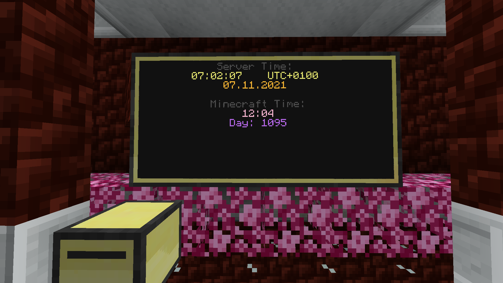
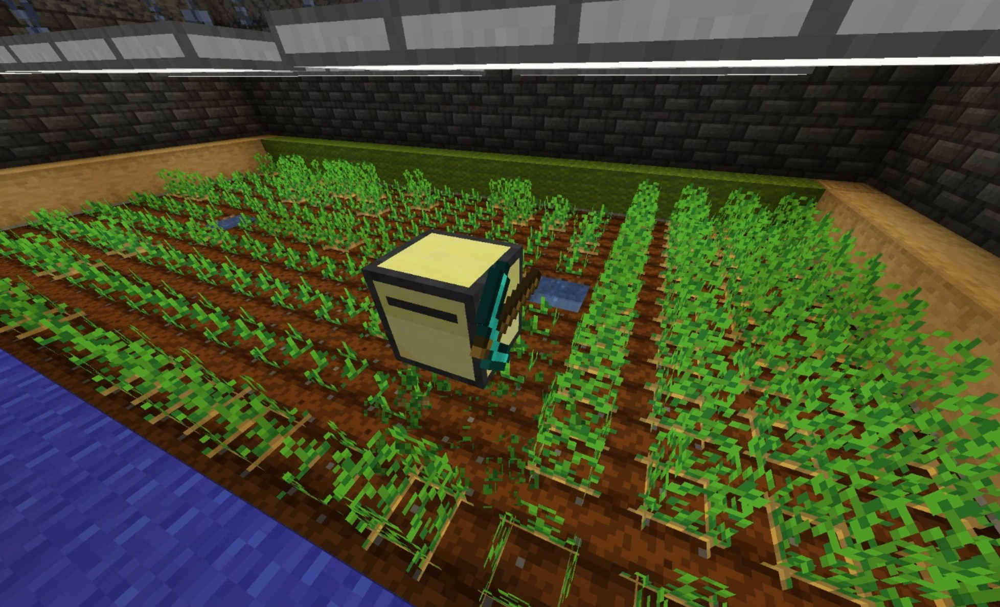
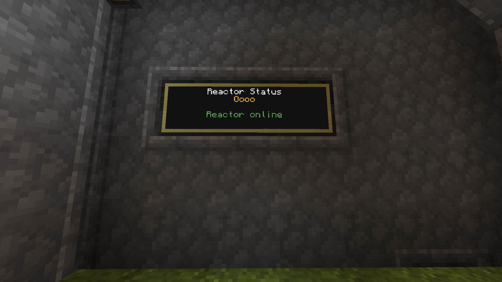
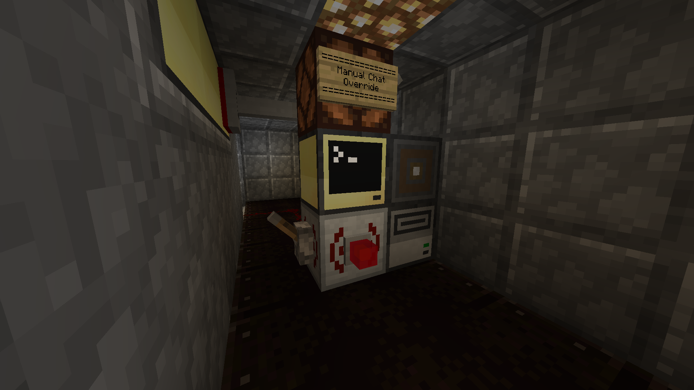

# What is this?

This is a collection of lua scripts made in "ComputerCraft: Tweaked", a Minecraft Mod.

https://www.curseforge.com/minecraft/mc-mods/cc-tweaked

## Contents

If you see a...

* ?[] next to the name, another mod/addon is needed for the full script "experience", but not required
* ![] next to the name, another mod/addon is required for the script

Additional mods/addons:

* [AP] [Advanced Peripherals](https://www.curseforge.com/minecraft/mc-mods/advanced-peripherals)

#### Note: You can always rewrite/comment out chunks of the code to make it work withoud additional mods!

### Display Time

A script that displays the current Minecraft and Server time to a monitor.

### Farming Turtle

Put this script on a mining turtle and enjoy your new ~~slave~~ helper!

This is my first actually useful AND (somewhat) well-written script!

### Reactor Control ?[AP]

A script I made to observe the state of a nuclear reactor (Mod: Mekanism), warning us if the reactor goes offline.

### Time Reminder ![AP]

A script to send chat messages on certain times (real time, not minecraft time) to remind of some events (for example: server restart).
